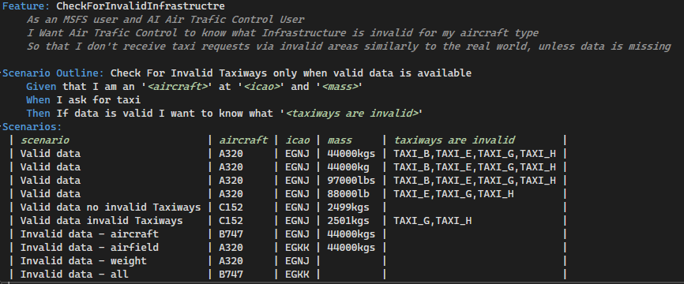
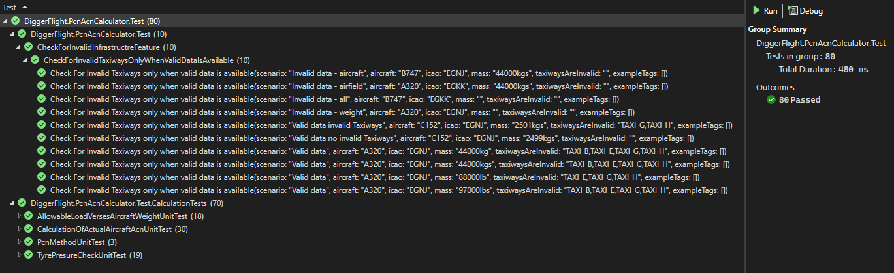

# DiggerFlight.PcnAcnCalculator

The code for the calculation was based upon the specifications derived in https://wiki.ivao.aero/en/home/training/documentation/ACN_-_PCN

The ACN data was sourced from with thanks from https://skybrary.aero/sites/default/files/bookshelf/4422.pdf

Only a couple of aircraft have been added for the purposes of testing.

Though the tests only cover kgs there is an untested lbs to kgs unit conversion to support our non SI unit countries.

The purpose of this project demostration is:


With the following Test results:


The Data for the Airfield is available on all the AIPs and as a final word this Airfield Operation json data needs to look like (be included) this:
```json
{
  "airfields": [
    {
      "ICAO": "EGNJ",
      "infrastructure": [
        {
          "name": "TAXI_A",
          "pcnValue": "55/F/B/X/U"
        },
        {
          "name": "TAXI_B",
          "pcnValue": "20/F/B/X/U"
        },
        {
          "name": "TAXI_C",
          "pcnValue": "30/F/B/X/U"
        },
        {
          "name": "TAXI_D",
          "pcnValue": "29/F/B/X/U"
        },
        {
          "name": "TAXI_E",
          "pcnValue": "20/R/B/X/U"
        },
        {
          "name": "TAXI_G",
          "pcnValue": "Up To 2500kg"
        },
        {
          "name": "TAXI_H",
          "pcnValue": "Up To 2500kg"
        }
      ]
    },
    {}
  ]
}
```
